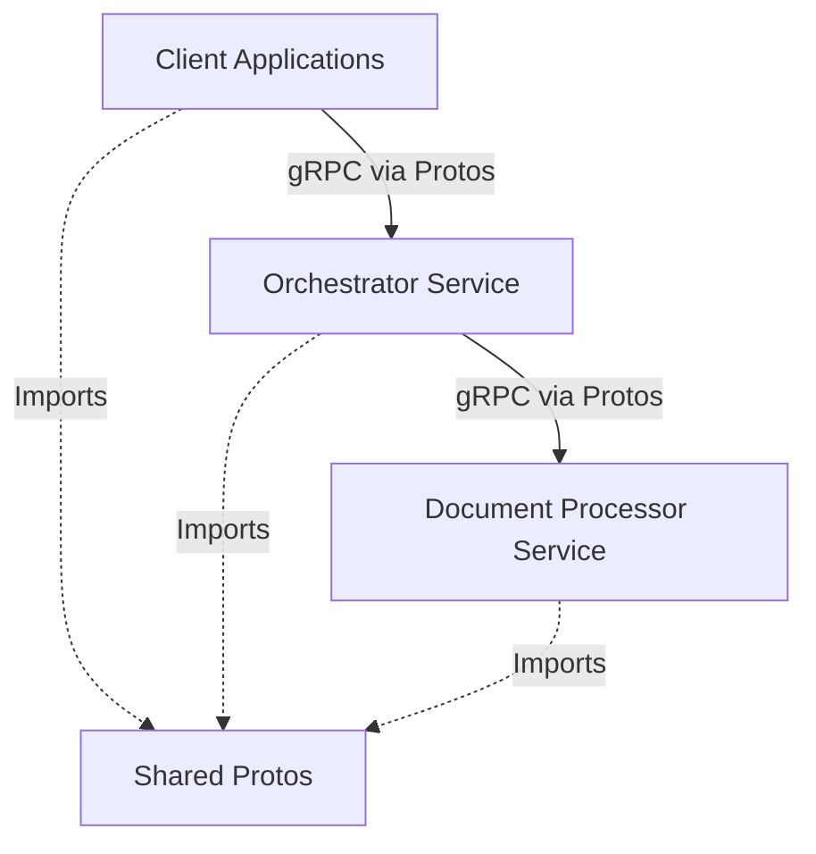

# Shared Protos

This repository contains the shared Protocol Buffer definitions for the Document Processor microservices. These protos define the unified gRPC contracts that drive communication between all components in the ecosystem.

## Documentation Index

- [Core Components](docs/01_Core_Components.md)
- [How To Implement](docs/02_How_To_Implement.md)
- [Service Communication](docs/03_Service_Communication.md)

## High-Level Architecture

